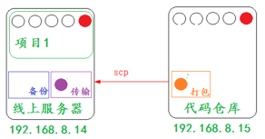
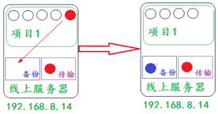

# 方案分析

**发布需求：**

​        手工方式部署代码

 **发布方案：**

​       **1.  获取代码**

​		模拟手工提交代码：sed -i 's#文件原始的内容#替换后的内容#g' 要更改的文件名

​        **2. 打包代码**

​        **3. 传输代码**

​       **4. 解压代码**

​       **5. 关闭应用**

​       **6. 放置代码**

​		&ensp;&ensp;&ensp;&ensp;&ensp;&ensp;&ensp;&ensp;备份老文件

​		&ensp;&ensp;&ensp;&ensp;&ensp;&ensp;&ensp;&ensp;放置新文件

​        **7. 开启应用**

​        **8.  检查**

**注意：**

​	获取代码和打包代码在代码仓库主机上进行操作

​	其他操作，都在线上服务器进行操作
