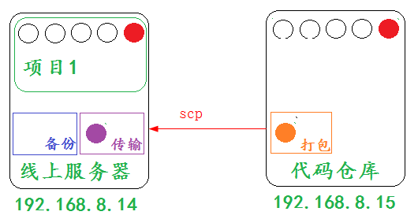
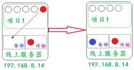
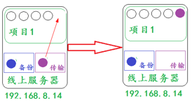

# 5.3 代码发布简介

学习目标：

1. 掌握代码发布流程
2. 掌握代码发布各子流程的技术关键点

---

### 5.3.1 流程简介

部署流程：


### 5.3.2 流程详解

**部署场景：**

​	两台主机做部署动作


​	注意：

​	部署的文件就是两台主机右上角的红色内容

**1.获取代码**

​	&ensp;&ensp;&ensp;&ensp;代码仓库

​        	&ensp;&ensp;&ensp;&ensp;&ensp;&ensp;&ensp;&ensp;集中式的：  svn

​       	 	&ensp;&ensp;&ensp;&ensp;&ensp;&ensp;&ensp;&ensp;分布式的：  git

​	&ensp;&ensp;&ensp;&ensp;区别：

​		&ensp;&ensp;&ensp;&ensp;&ensp;&ensp;&ensp;&ensp;svn的几乎所有操作命令，都集中在我和代码仓库服务器处于网络连接状态。

​		&ensp;&ensp;&ensp;&ensp;&ensp;&ensp;&ensp;&ensp;git的几乎所有操作命令，可以在本地完成，和代码仓库服务器是否连接无关。

​    	&ensp;&ensp;&ensp;&ensp;公司的代码仓库：

​        	&ensp;&ensp;&ensp;&ensp;&ensp;&ensp;&ensp;&ensp;私有仓库 gitlab

​        	&ensp;&ensp;&ensp;&ensp;&ensp;&ensp;&ensp;&ensp;内部服务器或者公网服务器

​    	&ensp;&ensp;&ensp;&ensp;仓库权限

​        	&ensp;&ensp;&ensp;&ensp;&ensp;&ensp;&ensp;&ensp;只有项目的开发人员才有权限，项目之外的人没有权限

​    	&ensp;&ensp;&ensp;&ensp;代码权限：

​        	&ensp;&ensp;&ensp;&ensp;&ensp;&ensp;&ensp;&ensp;开发、管理、查看

**2.打包代码**

​	&ensp;&ensp;&ensp;&ensp;场景演示：


&ensp;&ensp;&ensp;&ensp;目的：

​        	&ensp;&ensp;&ensp;&ensp;&ensp;&ensp;&ensp;&ensp;减少传输文件数量

​        	&ensp;&ensp;&ensp;&ensp;&ensp;&ensp;&ensp;&ensp;减小传输文件大小

​        	&ensp;&ensp;&ensp;&ensp;&ensp;&ensp;&ensp;&ensp;增强传输速率

​    	&ensp;&ensp;&ensp;&ensp;常见打包方式：

​        	&ensp;&ensp;&ensp;&ensp;&ensp;&ensp;&ensp;&ensp;windows:

&ensp;&ensp;&ensp;&ensp;&ensp;&ensp;&ensp;&ensp;&ensp;&ensp;&ensp;&ensp;zip、rar...

​        	&ensp;&ensp;&ensp;&ensp;&ensp;&ensp;&ensp;&ensp;linux：

&ensp;&ensp;&ensp;&ensp;&ensp;&ensp;&ensp;&ensp;&ensp;&ensp;&ensp;&ensp;tar、zip...

**3. 传输代码**

​	&ensp;&ensp;&ensp;&ensp;场景演示：



​    	&ensp;&ensp;&ensp;&ensp;传输方式：

​        	&ensp;&ensp;&ensp;&ensp;&ensp;&ensp;&ensp;&ensp;有网情况下

​        		&ensp;&ensp;&ensp;&ensp;&ensp;&ensp;&ensp;&ensp;&ensp;&ensp;&ensp;&ensp;多种方式：git、ftp、scp、共享挂载 cp、rsync

​        	&ensp;&ensp;&ensp;&ensp;&ensp;&ensp;&ensp;&ensp;没有网情况下

​        		&ensp;&ensp;&ensp;&ensp;&ensp;&ensp;&ensp;&ensp;&ensp;&ensp;&ensp;&ensp;物理方式： U盘或者硬盘

**4. 关闭应用**

​    	&ensp;&ensp;&ensp;&ensp;代码所在的服务用到了什么应用，就关闭什么应用

​	&ensp;&ensp;&ensp;&ensp;关闭的顺序：先关闭外网能访问的（离客户近的），后关闭外网不能访问的（离客户远的）

**5. 解压代码：**

​    	&ensp;&ensp;&ensp;&ensp;tar xf

**6. 放置代码**

​	&ensp;&ensp;&ensp;&ensp;为了避免我们在放置代码过程中，对老文件造成影响，所以我们放置代码一般分为两步：备份老文件和放置新文件。

​        &ensp;&ensp;&ensp;&ensp;备份原文件



​        &ensp;&ensp;&ensp;&ensp;放置新文件



​    	&ensp;&ensp;&ensp;&ensp;注意：

​        	&ensp;&ensp;&ensp;&ensp;&ensp;&ensp;&ensp;&ensp;两个文件的名称是一样的，只是内容不同

​        	&ensp;&ensp;&ensp;&ensp;&ensp;&ensp;&ensp;&ensp;对整个应用项目来说，两个文件没有区别

**7. 开启应用**

​    	&ensp;&ensp;&ensp;&ensp;刚才关闭了什么应用就开启什么应用

​	开启的顺序：先开启外网不能访问的（离客户远的），后开启外网能访问的（离客户近的）

**8. 检查**

​    	&ensp;&ensp;&ensp;&ensp;查看浏览器效果或者netstat -tnulp查看系统开放的端口

### 5.3.3 技术关键点

- **文件的压缩和解压**

  &ensp;&ensp;&ensp;&ensp;文件的压缩

  ​	&ensp;&ensp;&ensp;&ensp;&ensp;&ensp;&ensp;&ensp;压缩格式：tar zcvf 压缩后的文件名  将要压缩的文件

  &ensp;&ensp;&ensp;&ensp;文件的解压

  ​	&ensp;&ensp;&ensp;&ensp;&ensp;&ensp;&ensp;&ensp;解压格式：tar xf 压缩后的文件名

   &ensp;&ensp;&ensp;&ensp;命令参数详解

| 参数 | 作用                        |
| ---- | --------------------------- |
| z    | 指定压缩文件的格式为 tar.gz |
| c    | 压缩                        |
| v    | 显示详细过程                |
| f    | 指定压缩文件                |
| x    | 解压                        |

  查看压缩文件内容

&ensp;&ensp;&ensp;&ensp;zcat 压缩文件

- **文件的传输**

  ​    &ensp;&ensp;&ensp;&ensp;scp传输工具：

  ​        &ensp;&ensp;&ensp;&ensp;&ensp;&ensp;&ensp;&ensp;命令格式：scp  源文件   目标位置

  ​    &ensp;&ensp;&ensp;&ensp;将本地文件推送到远程主机

  ​            &ensp;&ensp;&ensp;&ensp;&ensp;&ensp;&ensp;&ensp;scp python.tar.gz root@192.168.8.15:/root/

  ​    &ensp;&ensp;&ensp;&ensp;将远程主机的文件拉取到本地

  ​            &ensp;&ensp;&ensp;&ensp;&ensp;&ensp;&ensp;&ensp;scp root@192.168.8.15:/root/python.tar.gz ./

  ​    &ensp;&ensp;&ensp;&ensp;远端主机文件夹位置的表示形式：

  ​            &ensp;&ensp;&ensp;&ensp;&ensp;&ensp;&ensp;&ensp;远程连接的用户@远程主机:远程主机的目录路径

  ​    &ensp;&ensp;&ensp;&ensp;远端主机文件位置的表示形式：

  ​            &ensp;&ensp;&ensp;&ensp;&ensp;&ensp;&ensp;&ensp;远程连接的用户@远程主机:远程主机的文件路径

- **文件的备份**

  文件的备份要有一定的标志符号，目前通用的是使用时间戳的形式来表示

  date命令详解：命令格式：date [option]

| 参数 | 作用                       |
| ---- | -------------------------- |
| %F   | 显示当前日期格式，%Y-%m-%d |
| %T   | 显示当前时间格式，%H:%M:%S |

  演示效果：

  ```bash
  显示当前日期：date +%F  2017-09-28
  显示当前时间：date +%T  03:06:30

  根据上面的参数介绍，我们可以指定命令显示的格式，

      年月日：date +%Y%m%d
      时分秒：date +%H%M%S

  	显示当前日期：date +%Y%m%d  20170928
  	显示当前时间：date +%H%M%S  030643

  指定时间戳格式：

      年月日时分秒：date +%Y%m%d%H%M%S

  备份命令效果格式：

  	方式一：复制备份
  		cp nihao nihao-$(date +%Y%m%d%H%M%S)

  	方式二：移动备份
  		mv nihao nihao-$(date +%Y%m%d%H%M%S)

  为了避免在放置新文件时候，出现验证操作，采用方式二
  ```

**小结：**

1. 代码发布：安全代码部署到线上服务器

2. 代码发布方式：手工+脚本

3. 代码发布流程：

   获取代码:权限       打包代码:tar           传输代码:scp

   停止应用:先近后远   解压代码:tar           放置代码:先备后放

   开启应用:先远后近   检查效果:浏览器+端口    对外开放

4. 代码发布技术关键点：

   文件打包:   压缩(tar zcf)  解压(tar xf)   查看(zcat)

   文件传输:   scp  用户@地址:要传输的文件 本地放置路径

   文件放置:   mv nihao nihao-$(date +%Y%m%d%H%M%S)
